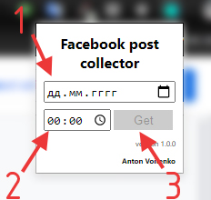

# facebook-post-collector-extention

### Версия 1.0.0

_Расширение работает со следующими браузерами: Google Chrome_

## Описание

Собирает все посты из групп в которых есть уведомления, до указанной даты. Все посты сортируются по дате добавления(сначала новые) и выводятся на одной странице.

## Установка

```
  1. Перейти во вкладку расширения;
  2. Включить режим разработчика;
  3. Нажать "Загрузить распакованное расширение";
  4. Выбрать папку с расширением.
```

## Как пользоваться



```
  1. Ввести дату;
  2. Ввести время;
  3. Нажать кнопку.
  4. Ждать завершения работы расширения(открытие страницы index.html с собранными постами)
```
